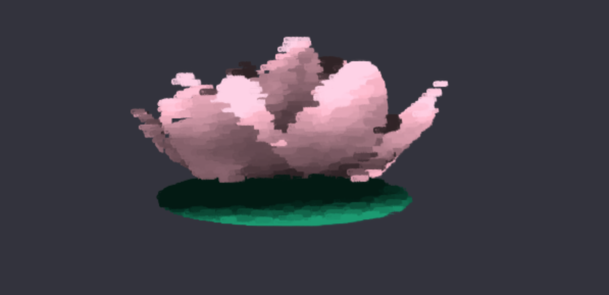

# Nonphotorealistic Shader

### Demo
https://anniesu1.github.io/nonphotorealistic-shader/

### Overview

This is a painterly shader. It is based on the paper [Painterly Rendering for Animation](http://delivery.acm.org/10.1145/240000/237288/p477-meier.pdf?ip=165.123.195.131&id=237288&acc=ACTIVE%20SERVICE&key=A792924B58C015C1%2E18947888DF2D0EEA%2E4D4702B0C3E38B35%2E4D4702B0C3E38B35&__acm__=1556383516_87d96d94f943037c41015bc624025f33). I drew inspiration from impressionistic paintings of water lilies for my final scene set-up. 

### Implementation Details
__PARTICLE PLACEMENT THROUGHOUT A MESH__
* A mesh obj file was loaded, and particles were programmatically distributed throughout the mesh. A mesh consists of (among other things) vertices and faces (formed by every 3 vertices). 
  * Per triangular face (assuming the mesh is triangulated), calculate its area by taking the cross product of the two
  vectors that form the triangle and dividing it by two, since the cross product gives the area of the parallelogram. Store
  each face area in an array, `triangleAreas`.
  * Find the smallest element in `triangleAreas` and divide every element by it, rounding up to the next integer.
  * Sum up the elements of the `triangleAreas` array and initialize a second array, `expandedTriangleAreas` that has a length equal to the sum. Initialize the elements of the new array such that the index i of a triangle is repeated as many times as it’s corresponding values on the first array. 
  * Pick a random element in the expanded array, which will yield an index. Use the index to find a random position inside
  the mesh. This will be the position of a particle.

__BRUSH STROKES__
* Instanced rendering of brush strokes (i.e. particles): each brush stroke is a png texture rendered on a square.  
* Z-depth sorting: in order to get proper alpha blending, we sort all the brush strokes by decreasing distance from the camera, such that the farthest brush stroke gets rendered first (this is similar to the Painter's Algorithm).
* Brush stroke attributes:
  * Size: random
  * Orientation: currently uniform
  * Color: the color of a brush stroke is based on a reference image. The reference image consists of a lambertian shading of the original mesh. This reference image is stored as a texture that is then passed to the instanced shader, which looks up the color using computed uv coordinates for the brush stroke. Note that each brush stroke takes on exactly _one_ color. This allows for successful shading "over the edges" of the mesh. 
* The user can select out of 3 different brush stroke textures and can also tune the brush stroke size. 

__ASIDE__
* The scene is relatively simple, since as more meshes and instances of meshes are added, the number of particles is increased linearly. However, each mesh consists of 1000000 particles, so this does wind up significantly slowing down the frame rate.

### Write-up for milestone

hello, i'm sorry for the lack of progress on this milestone. i am definitely going to work hard on it during the remaining time! basically, i set up importing of textures and have outlined for myself a basic framework / pipeline to go about. i am currently stuck on:
* how to scatter particles throughout a 3d mesh

and i plan to work on, in the following order:
* drawing a brush stroke at each particle position
* to add complexity, at each particle position, give the particle where the brush will be the following brush attributes: stroke size, orientation, color, noise offset...and THEN drawing a stylized brush stroke
* z-depth sorting (in order to get a proper painter's algorithm in there) 
* note: i think i'm scrapping my original idea of doing a forgery of a spirited away gif because i'd rather have the artistic freedom to create something new. please let me know if there may be issues with me wanting to create my own custom scene ! and sorry for the tumultuousness. 

### Resources
__Papers__
- painterly rendering for animation by meier (3d) - http://www.eecs.umich.edu/courses/eecs498-2/papers/meier96.pdf
- painterly rendering with curved brush strokes of multiple sizes (for images only, not 3d) - https://www.mrl.nyu.edu/publications/painterly98/

__Misc__
- cmu slides - http://graphics.cs.cmu.edu/nsp/course/15-462/Spring04/slides/21-npr.pdf
- computer vision techniques - https://www.cs.utah.edu/~shirley/papers/painting.pdf
- review of existing painterly approaches - https://onlinelibrary.wiley.com/doi/full/10.1002/cav.1435
- jhu slides - http://www.cs.jhu.edu/~cohen/RendTech99/Lectures/Painterly_Rendering.color.pdf
- database of painterly rendering resources - https://www.mrl.nyu.edu/projects/npr/

